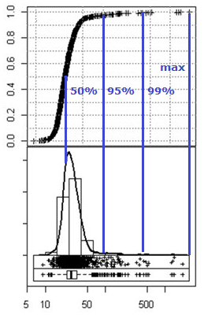

Power diode characteristics (IEC 60747-2:2001)
===

### Part 1: measurement fundamentals
---

To conduct our experiments, we build a setup around a chopper or half bridge module arrangement for clamped inductive load switching which provides fast commutation, driving current through the low-side device under test, then switching it back to a DC link capacitor bank charged to a nominal test voltage. 

This way both turn-off, decay, and turn-on events are produced in sequence, giving the pattern the name "double pulse test".

#### double pulse test - passive components

This test setup has a storage inductor large enough to exhibit a moderate dI/dt=UDC/L when initially connected to the DC link voltage (first pulse) and a slow current decay during the pause between the two pulses, so turn-off and turn-on events bracketing this pause happen at essentially the same current.

As an arbitrary lab power supply is too slow to provide instantaneous charging and the required magnetic energy extracted from the capacitor rises with test current, the DC link voltage needs to be raised accordingly.
The capacitor bank thus needs to be capable of providing both the magnetic energy to establish the test current in the inductor and the proper residual charge to present the test voltage across the D.U.T. terminals right after reverse recovery without exceeding voltage ratings and voltage safety margins. 

#### double pulse test - pattern

The double pulse test pattern shown below and implied here is a versatile sequence of two pulses controlling a half bridge arrangement and allows measurement of device performance:

* switching characteristics extraction through commutation transients
* instantaneous on-state voltage and current extraction in zones before the transient(s).

The overall timing for repeated measurements that do not affect one another (especially thermally, not considering bank recharging and settling) is given below:

#### double pulse test - setup details

There are several test setup variants that produce a steady-state equilibrium current flow in the power diode. To simplify the measurement setup, we only consider configurations with low-side IGBT or diode devices under test. The 60747-2 standard for the measurements performed here is not complete in its requirements and definitions, but leaves room for adaption and common sense, with the demand that choices and implementations shall be explained and documented.

The setup for low side diode measurements comes with the recommendation to utilize the IGBT already integrated into half bridge modules, because it is likely to be the lowest inductance solution and the obvious choice. Current sensing solutions usually complicate matters, as both inductive current sensors as well as almost "purely resistive" shunts add error voltages.  

Replacing the Pearson Current Probe below with a threaded coaxial shunt yields the configuration for an Infineon HP-DSC, because the LS emitter lead is connected to the shunt housing, defining the scope reference. 

For resistive shunt current measurements, the following setup properties emerge:

* the D.U.T. voltage is measured directly
* the D.U.T. current is measured directly
* the apparent DC link voltage is reduced by the shunt dropout voltage 

As the shunt voltage changes, the apparent DC link voltage the D.U.T. is subjected to changes accordingly. For a 10 mOhm shunt and VDC over 100 V, this constitutes an error around 5 % or below, which has to be put into perspective with the error voltages introduced by current changes in parasitic inductances throughout the setup (these should be minimized especially by minimizing commutation loop inductance and providing a low-ESL capacitor bank). 

### real-world challenges and approaches to deal with them
---

Challenges are encountered both when implementing the experimental setup, establishing its voltage and current handling capabilities and implementing proper measurements of voltages and currents with low inductance probing techniques and components. The construction of the experimental setup is a challenge in its own right and shall be discussed elsewhere - here we give an overview over the measurement principle and implementation to supplement the discussion of requirements and resulting experimental analysis.

Data analysis from real-world data (here: waveforms captured with an oscilloscope) demands

* robust determination of averages, minimum and maximum values
* linear fits and
* threshold intersection points

to find characteristic values, time intervals and integrals. 

#### mean and median

>Note:
>
>The mean of a set of numbers is the sum of all the numbers divided by the cardinality.
>
>The median of a set of numbers is the middle number, when the set is organized in ascending or descending order (and, when the set has an even cardinality, the mean of the middle two numbers).

In essence, the mean value is most representative for samples symmetrically scattered around the true value, while the median is more relevant when the sample value distribution is skewed, for example because it contains glitches or outliers.

Beyond the median which is the 50th percentile (having 50% of all samples below the median value), other percentiles also have interesting properties eludicated in the picture below:

imagine the scatter plot representing sample data, with the histogram denoting frequency. The upper graph is the associated cumulative histogram normalized to 100% of all samples. As each sample trivially contributes one Nth, the integral histogram is also obtained by sorting all sample values (but then the axes are swapped).

When looking for robust minimum and maximum values, it can be advantageous to discard the most extreme 0.1% to 1% of all values which are most likely noise outside the curve in question, including an error band around it. Note how even the 99th percentile rejects the small number of outliers to the right.

In the analyses described here, we will use the mean value to average over noisy, slowly varying waveforms, while employing e.g. 1% and 99% percentiles for minimum and maximum value estimations. 

This holds true for a certain degree of waviness, as the farthest outliers will still be at the outer edges of the histogram, just that, in relative terms, noisy samples elsewhere will be shifted into the distribution. Thus one will need to evaluate percentile behaviour and bump the points to e.g. 0.2 % and 99.8 %.

The extracted values and timings are included in the plots for easy visual inspection and validation of the automatically generated analysis results.

#### intersections

Trigger generation is a defining feature of oscilloscopes like no other, as the trigger points allow averaging of periodic events and parameter extraction beyond the actual single shot capturing of high resolution data.

Here we discuss the implemented offline calculation of threshold intersections to find characteristic time markers.

We will catch up with the treatment of ringing and transients overlaying the waveforms in question when moving towards nanosecond timescale measurements of high speed power semiconductors. For silicon IGBTs and diodes, we will first consider how to handle inherent measurement noise, since the ringing attributable to parasitic circuit elements and the switching waveforms mostly separate on different timescales and magnitudes of signal.

>Note:
>
>Below we shall assume that ringing observed in the oscilloscope waveforms is an actual feature of the current or voltage over time and not an artifact produced by shunt current measurements or resistive voltage dividers and mismatched cable connections, or even buffer amplifiers.
>
>
>
>
>
>(The gate waveform is measured across the gate driver connections and is picked up differentially because the emitter contact is not not equivalent to the DC- terminal in a high frequency model.)

Let's consider this bit of actual sample data. Although the behaviour of the experiment should be understood from design and simulation prior to looking at the resulting measurements, the data is most informative when it comes to resolution, accuracy, noise and parasitic effects.

It is immediately obvious that the first zero crossing at the ID negative going slope and the reverse recovery maximum current are benign quantities - as opposed to the time where current tapers off.

Looking at a zoom of the noisy waveform overlayed with ringing to investigate the challenges of threshold detection. Let's try to specify where the waveform crosses the zero line:

A couple of possible interpretations arise:

1. the zero crossing time is the time coordinate of the first sample on the side other than that of the starting sample (not shown). This is a nearest neighbour approximation of the next case
2. the zero crossing is the first intersection of linear interpolations between subsequent samples (crosshair on the left)
3. based on a characteristic timescale, the region around the first crossing according to 1. is represented with a linear curve fit and the zero crossing is assumed to be where the fit curve has its zero crossing.
4. based on a characteristic timescale, the data is low pass filtered and subjected to simple zero crossing detection as in 2. . In our example, no zero crossing is found.

In light of this sensitivity to the detection method it must be considered what prior assumptions can be added to the input:

* an interval where the zero crossing can possibly occur can be given
* features identifiable as transients or ringing could be masked or filtered
* an estimate can be generated for more detailed, locally stable analyses. 

To decrease the likelihood of false results,

* **bandwidth limiting and/or averaging of multiple acquisitions (preferably on the oscilloscope) drastically reduces random noise issues**
* results of different methods can be compared and 
* plausibility checks can be introduced.

In the code referred to here, a linear fit is produced around the first level crossing according to 2. During processing of larger data sets it was found that sometimes near-horizontal fits would be produced that have intersections escaping towards plus or minus infinity. Subsequently a plausibility check was introduced, requiring that the <i>refined</i> intersection be withing a certain distance to the initial crossing point.

As we move towards measurements at higher speeds and rates of current and voltage change, it may become necessary to add damped oscillations to the fit function or attempt to remove the parasitic oscillatory response by deconvolution. 

On the other hand, modelling of parasitic circuit behaviour and more realistic, transient device characteristics is rather involved and not necessarily supported by the manufacturer. As the strides made to establish our own double pulse testing setup and analysis software serve to extract parameters and build models beyond what is supplied by the manufacturers in the first place, this approach helps to inform the setup and calibration process but might remain questionable beyond that.

Returning to the experimental work associated with the double pulse test:

> There is great value in getting to know the quirks of the physical setup, from shunt resistor performance testing, to adding additional capacitors to the DC link and near the module terminals, to adding ferrite material to traces and loops suspected to contribute to parasitic effects, as the artifacts of the acquired waveforms show great sensitivity to additional capacitive loading, bypassing and changes in inductances.

#### parasitics and ringing

The reverse recovery is highly dynamic, with varying rates of current and voltage changes. with the reverse recovery current reaching its extremum, the space charge region starts forming again, which is directly related to an increasing voltage drop forming across the device under test.

Three other semiconductor parts in the half bridge arrangement contribute with (voltage dependent) device capacitances. 

>The observed oscillations are plausible assuming such capacitances in the nF range oscillating with 20 .. 50 nH commutation loop inductance (including module, conductor and capacitor ESL contributions) and are the major challenge when it comes to building a representative double pulse measurement setup.

For most of the silicon device measurements investigated at this time, only a fraction of the single measurements fail to evaluate automatically and the failure cases can be inspected visually. 

We will look at the subject in more detail below when defining the timing below. Let's now commence with the requirements and implementation of the automated analysis.

#### probe calibration

As a brief excursion, let's also have a look at the source of the data in question to help elucidate the origin of artifacts and convey how seriously one should take single-sample values, beyond oversampling and input stage filtering to avoid aliasing.

Passive oscilloscope probes (e.g. 10:1 and 100:1 for high voltage) contain compensation capacitors to tune their performance with respect to scope input properties.

As we attempt to make absolute measurements in a transient scenario, some assumptions are made:

* both probes and oscilloscope provide excess nominal bandwidth for the phenomena studied
* the oscilloscope has reached steady-state temperatures and calibrations have been performed after settling at the vertical and horizontal scales used in the experiment
* probe LF (and if available HF) adjustments have been made to ensure absolute accuracy on fast time scales and quick settling.

Scope channel calibration can be triggered manually or by the measurement control software. Probe propagation delay, or skew, is compensated manually. Signal propagation through both cables and amplifiers (e.g. from current probes) amounts to single-digit nanosecond horizontal offsets. 

Probe calibration is performed for each probe connected to its designated channel. When 100:1 probes are used for high speed measurements, one may need to use a test circuit (e.g. a GaN half bridge or one made from low gate and output capacitance Si MOSFETs) to fine tune the absolute value of the LF compensation effect.

The slow calibration source signal (e.g. 1 kHz) might appear as follows:

HF compensation is similar, albeit on a 4 to 5 orders faster timescale (10 .. 100 ns/div). Left and right waveforms show under- and over-compensated cases, respectively.

This time no completely flat plateau is achievable up to the transition, as both the signal generator and the physical setup with small parasitic elements create ringing and the compensation elements don't act on all real probe characteristics.

Finally, the scope bandwidth has to be sufficient to reproduce slopes and transient changes with acceptable distortion. While the interconnectedness between time and frequency domain is not immediately obvious, the approach to require a small number of in-band harmonics corresponding to the duration of the smallest relevant waveform feature as the fundamental seems good enough for ballpark estimates. 

#### measurement fundamentals and real-world challenges - conclusions

In this section the properties of real oscilloscope waveforms for transient measurement of device characteristics have been looked at, both from the data analysis side where robust algorithms have to find features, and from the experimental side to put observed effects in context in an effort to inform decision making when implementing the analyses and reviewing the output produced by them. 

The following sections will cover the definitions and detailed implementation of the diode switching characteristics measurements. 

