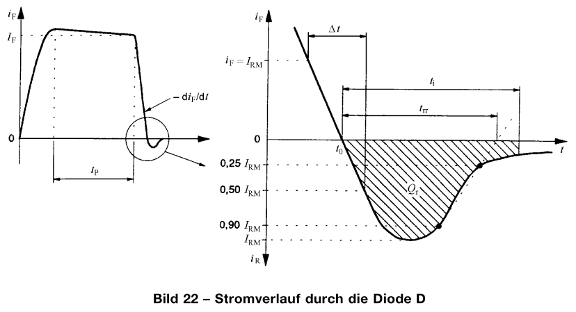
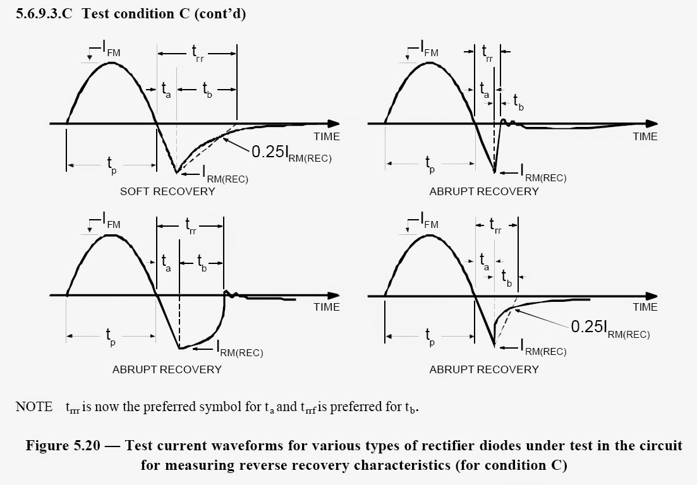
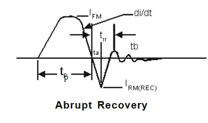
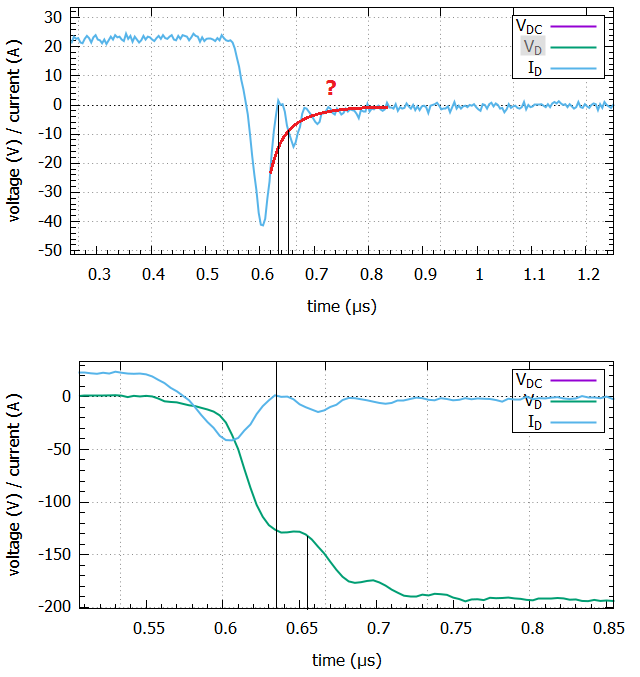
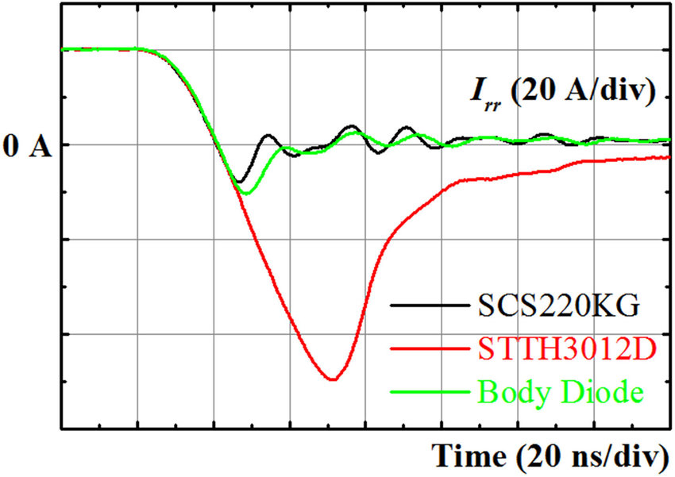
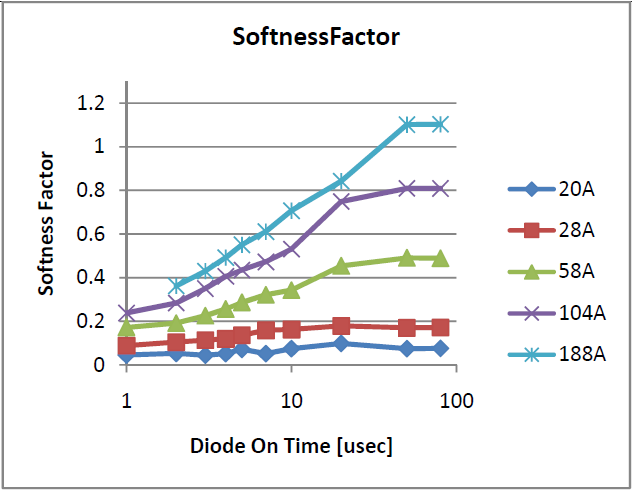
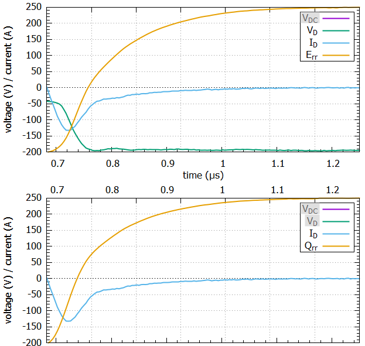
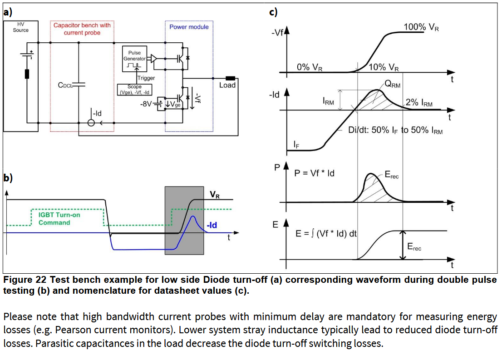

Power diode characteristics (IEC 60747-2:2001)
===

### Part 2: reverse recovery data analysis challenges
---

Diode transient behaviour is observed as a combination of device characteristics and manifestations of parasitic behaviour. Depending on the severity of parasitic oscillations on the one hand and the snap-off behaviour of the part in question on the other hand, the choice of definitions for timing and integral value extraction may vary.

Yet we need to determine a set of quantities and how they are to be extracted to be able to perform our measurements. 

#### definitions

In the following, the definitions for extraction of the following quantities will be given:

* IF - forward current right before the begin of switching
* VF - momentary forward voltage at IF with known temperature due to negligible heating effects
* t0 -  first zero crossing and reference time for reverse recovery and integration time definitions
* trrr - time between first zero crossing and reverse maximum current
* trrf - time from the IRM extremum to the nominal (geometrically constructed) end of the reverse recovery event
* dIrr/dt - reverse recovery event negative-slope diode current in linear approximation 
* dIrf/dt - reverse recovery event positive-slope diode current in linear approximation 
* dIrf,max/dt - peak reverse recovery event positive-slope diode current
* trr - reverse recovery time
* ti -  integration time
* Qrr - reverse recovery charge integral over [t0;ti]
* Err - reverse recovery energy attributable to the diode (see ST AN5028)
* RRSF = (dIrr/dt)/(dIrf,max/dt) - reverse recovery softness factor

The quantities will be explained in the context of nominal and real waveforms, pointing out missing accuracy and incompleteness in the wording, and concluding with the definitions chosen for the analysis at hand.

#### reverse recovery timing markers

Snappy recovery diodes produce a well-defined intersection e.g. with a 10 % IRM level, while soft recovery diode have multiple time constants for their current decay in the second half of the recovery process.

Let's look at a IEC60747-2 definition for the construction of trr:

Note the region of low curvature around the extremum IRM - this waveform feature suggests an explanation as to why there are two suggested methods to derive the reverse recovery time trr:

* trr is the time from the negative-going zero crossing, to the current tapering down again to a small fraction of IRM (not specified, but let's consider 10 % for illustration purposes)
* trr is the time from the negative-going zero crossing to where a line through two points (A and B) intersects the zero axis. A is at 0.9 IRM or 1.0 IRM.

For triangular current waveforms, the IRM point might be just as good as the 90 % crossing point following it, whereas a more parabolic recovery current curve will benefit from the secant (note it only rarely is a tangent) being offset to the right. The definition also needs to be adequate over a range of different diode geometries and temperatures the parts are characterized at.

JEDEC 282B01 also has some interesting ideas when it comes to reverse recovery nomenclature and analysis:

The test condition depicted, implying a sinusoidal pulse, is rather inconsequential to the recovery event (save for the evolution of the reverse voltage applied to the device under test towards the end of the recovery process). Interestingly though, the occurence of an early positive-going waveform zero crossing preceding the zero crossing of the positive-going secant prioritizes the earlier time.

Microsemi depict a snappy recovery waveform in their MicroNotes Series 302 with yet another definition:

The waveform might be taken from JESD41 or MIL-STD-750, Method 4031, notably the trr appears to extend beyond the first zero crossing.

> Newer JEDEC and international IEC standards will soon be recognizing soft and abrupt features with Reverse Recovery Softness Factor RRSF which is defined as the absolute value inratio of di/dt slope in the ta region divided by greatest magnitude of di/dt slope in the tb region.  Reasons for this become apparent when considering practical applications. If the tb region is very short and abrupt, the effect of rapid current change with other circuit loop inductance can produce undesired transient voltages.  If this L*di/dt effect in the tb region is high compared to the ta region, it can result in an undesired reverse voltage peak that meets or exceeds the “buss line” voltage VR [..]

**Should the waveform zero crossing take precedent over the geometric construction by default?** 

Possibly, with the reservation that peaks of an overlaid oscillation should not cause a premature end of the trr interval. The next example takes one of those cases where a soft recovery diode is measured with ringing. 

Both the secant-derived time and the current waveform zero crossing constructions as seen above likely result in an early time estimate, while alternative definitions as an extension seem even harder to motivate. Assuming settling to within 25 % or 10 % around VDC, trr does become significantly longer while being subjected to ripple on the voltage waveform.

Here's a set of corresponding SiC PN, SiC SBD and a Si PiN diode (STTH3012D) reverse recovery waveforms:

In other publications (e.g. Efthymiou 2016), SiC and GaN diodes are associated with (near-)zero reverse recovery charge, hinting at the blurred lines and measurement challenges on these timescales.

> [...] the SiC vertical Schottky diodes are by far the closest to the claim of zero reverse recovery losses. This very significant result can be explained when considering the differences in the structure of the GaN and SiC diode. While charge is uniformly distributed in the volume of the drift region of a SiC diode, it is confined at the interface of the heterojunction for the AlGaN/GaN Schottky diode (see Fig. 1). When the SiC diode is turning off, the depletion region extends vertically into the drift region along the entire length of the Schottky contact. On the other hand, when the GaN Schottky diode is turning off the 2DEG layer is depleted laterally from the recessed Schottky contact and vertically from the GaN layer. A high concentration of carriers is removed through the narrow path of the 2DEG layer which extends only up to a few nm away from the heterointerface. [...] - Efthymiou et al., 2016, DOI: 10.1109/ISPSD.2016.7520780 

The quality of the trr extraction thus needs to be re-assessed when moving to faster timescales and new materials. For the time being, it is recommended to inspect the results of automated analysis and reject measurements at low currents where ringing is most pronounced and suspected to affect trr and Qrr.

In conclusion, we will use the IEC 60747-2 secant intersection point method and add the early direct zero crossing of the current waveform, both in preparation for faster wide bandgap (WBG) semiconductor devices and for plausiblity checking.

#### the problem with snappiness

From Mari et al. 2015, "Diode snappiness from a user’s perspective":
	
> [...] it is important to realize the reasons why snappiness matters. In fact, a naive approach to the problem would be to accept any diode, snappy or not, as long as the diode does not fail in operation. This approach is however risky. Understanding where the risk lies is the key to providing a useful definition. [...] 

> First and foremost is the problem of the associated overshoot (in the cathode-anode voltage) across the device when it recovers. Overshoot is primarily a function of the current gradient as the diode recovers, together with the passive components, often of parasitic nature, connected to the diode. [...]

> Historically, a diode is soft if [the RRSF] exceeds 0.8. Snappiness refers to the sudden slope change, or rupture, of the reverse recovery current during the second period. The problem is that this can happen any time during this interval and not necessarily up to the moment the current falls back to 20% of its peak. Keeping the structure of the definition but changing the threshold is insufficient to correct its shortcoming[...]

> We propose: a diode is snappy, if  having conducted some arbitrary time, at turn off, for some current lower than 1/10th the rated current, some temperature in the intended operating range and in the converter environment in which it will operate, a) the voltage overshoot at turn off exceeds 20% that of the prevailing link voltage at test and b) after the current falls back from its reverse recovery peak, there appear  oscillations with an empirically determined damping factor as of a second order system being less than 0.5.

Beyond the obvious need for application design information, there needs to be a reliable figure of merit to characterize power diodes. What the paper highlights is not only the lack of a general and robust definition in the literature but also its lack to assess snap-off behaviour over an array of operating conditions.

#### derived quantities - Qrr integration interval [t0;ti]

On another note, the challenges encountered when trying to define trr also hint at why the recommendation for the integral time definition ti differs from that of the reverse recovery time - should be equal to or larger than trr. 

When looking at Qrr, it is clear that - in particular for soft recovery diodes - trr is not a good definition of the integration time.

Let's have another look at some real-world test data of an EMCON Si-PiN diode to get a feel for the relation between the current waveform and the cumulative quantities Qrr and Err:

Evidently only about 2/3 Qrr and 1/2 Err have accumulated when basing the integration interval on trr. As the diode current ultimately decays to some minor reverse leakage current overlayed with oscillations and possible measurement offsets, there is not much harm done when opting for a more conservative definition.

[Infineon AN2010_09](https://www.infineon.com/dgdl/Infineon-AN2010_09_Automotive_IGBT_Modules_Explanations-AN-v1.0-en.pdf?fileId=db3a30432c59a87e012c5ee8648e355e) for example take a 10 % reverse voltage and 2 % IRM thresholds to define start and end of the integration interval:

The Qrr and Err integration intervals have integrands that taper down to values near zero around the start and end points of the interval, so the 10 % VR point is expected to be compatible with the current waveform negative going zero crossing.

To obtain a robust measure of the dIF/dt rate, 50 % points of IFM and IRM define a linear fit region. Again, the current slope should be rather linear, making this definition compatible with one what would put the interval start where the current first starts dropping (e.g. at 90% IFM).

In the next part the actual implementation will be defined.

