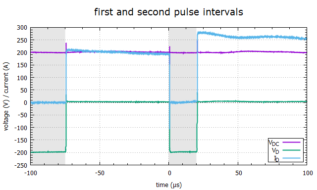
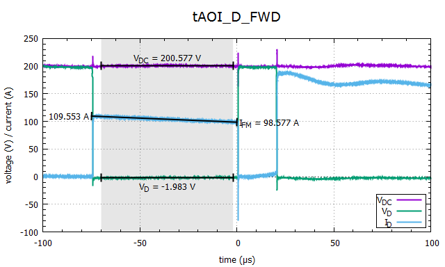
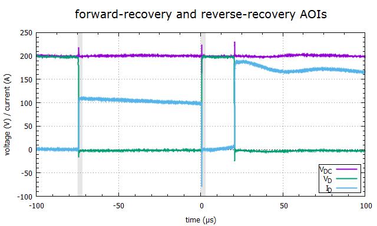
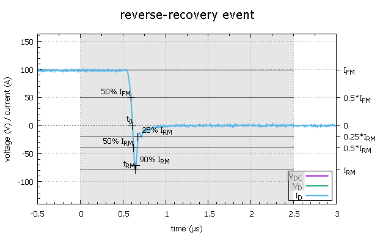

Power diode characteristics (IEC 60747-2:2001)
===

### Part 3: comprehensive analysis parameters
---

Let's now specify all the quantities to be derived from the double pulse measurement waveforms in question.

* IF = **I\_rr\_fwd\_lin\_estimate** - forward current right before the begin of switching
* VF = **V\_D\_1st\_on\_av** - momentary forward voltage at IF with known temperature due to negligible heating effects
* t0 -  first zero crossing and reference time for reverse recovery and integration time definitions
* trrr - time between first zero crossing and reverse maximum current
* trrf - time from the IRM extremum to the nominal (geometrically constructed) end of the reverse recovery event
* dIrr/dt - reverse recovery event negative-slope diode current in linear approximation 
* dIrf/dt - reverse recovery event positive-slope diode current in linear approximation 
* dIrf,max/dt - peak reverse recovery event positive-slope diode current
* trr - reverse recovery time
* ti -  integration time
* Qrr - reverse recovery charge integral over [t0;ti]
* Err - reverse recovery energy attributable to the diode (see ST AN5028)
* RRSF = (dIrr/dt)/(dIrf,max/dt) - reverse recovery softness factor

#### trigger position and pulse durations

A basic set of (nominal) time durations are given as header information and are extracted before any further quantities are calculated:

	d.par['t_1st_duration'] =  float(d.hdr['pre-charge [mS]']) * 1E-3
	d.par['t_inter_pulse_duration'] = float(d.hdr['pause [mS]']) * 1E-3
	d.par['t_2nd_duration'] =  float(d.hdr['puls [mS]' ]) * 1E-3

Furthermore we imply the oscilloscope is configured to trigger at the the start of the second pulse and t0 is in the center of the sample dataset:

	t_trigger = 0

This assumption holds for Si IGBTs as the pulse durations are significantly longer than the switching events, but may need adjusting for propagation delays and skew. The resulting absolute nominal timing markers are

	d.par['t_1st_rise_nom'] = t_trigger - d.par['t_inter_pulse_duration'] - d.par['t_1st_duration'] 
	d.par['t_1st_fall_nom'] = t_trigger - d.par['t_inter_pulse_duration']
	d.par['t_2nd_rise_nom'] = t_trigger # coincident with trigger 
	d.par['t_2nd_fall_nom'] = t_trigger + d.par['t_2nd_duration']

Levels, linear regression analyses and integral value calculation require plausible interval definitions, henceforth referred to as timing-area-of-interest (tAOI_<name>).

#### tAOI\_D\_FWD : VDC , VFWD , ID  

In the pause between the two pulses the diode is in forward conduction mode. After a few microseconds, the silicon diode should have reached steady-state equilibrium. DC link voltage, diode forward voltage and measurement current can be extracted here.

	d.par['tAOI_D_FWD'] = [d.par['t_1st_fall_nom'] + 5E-6, d.par['t_2nd_rise_nom'] - 2E-6] 
	d.par['tAOI_D_FWD_begin'] = d.par['tAOI_D_FWD'][0]
	d.par['tAOI_D_FWD_end'] = d.par['tAOI_D_FWD'][1]

The nominally constant voltages are extracted via averaging, while the current waveform is approximated with a linear function. Extrapolations to the nominal commutation times t\_1st\_fall\_nom and t\_2nd\_rise\_nom are calculated in extrapolation.

	d.res['V_D_1st_on_av'] = d.CH[d.par['CH_VD']].average(d.par['tAOI_D_FWD'])[0]
	d.res['V_DC_1st_on_av'] = d.CH[d.par['CH_VDC']].average(d.par['tAOI_D_FWD'])[0]
		
	d.res['I_1st_on_fit_a_bx']  = d.CH[d.par['CH_ID']].lin_fit(d.par['tAOI_D_FWD'])
	I1 = lambda t, a=d.res['I_1st_on_fit_a_bx'][0], b=d.res['I_1st_on_fit_a_bx'][1] : [t, a + b*t]
	d.res['I_1st_fr_peak_lin_estimate'] = I1(d.par['t_1st_fall_nom'])
	d.res['I_rr_fwd_lin_estimate'] = I1(d.par['t_2nd_rise_nom'])

#### tAOI\_1st\_fr\_event , tAOI\_rr\_event 

Forward and reverse recovery events may be shifted by propagation and switching delays by 1 .. 50 ns, but for a given setup (temperature range, gate driver and device technology), appropriate bounds can be specified within switching events are guaranteed to take place. 

For all pratical considerations, the turn-on and turn-off delays are in the 20 .. 1000 ns region and dominate the acquisition and analysis timings.

Theoretical calculations and preliminary datasheet values can be used to define the intervals, but here the values are determined empirically during setup measurements, assessing switching behaviour across the parameter space in a sparse manner.

	d.par['tAOI_1st_fr_event'] = [d.par['t_1st_fall_nom'] - 0, d.par['t_1st_fall_nom'] + min(2.5E-6, 0.9*d.par['t_inter_pulse_duration'])]
	d.par['tAOI_1st_fr_event_begin'] = d.par['tAOI_1st_fr_event'][0]
	d.par['tAOI_1st_fr_event_end']   = d.par['tAOI_1st_fr_event'][1]	
	d.par['tAOI_rr_event'] = [d.par['t_2nd_rise_nom'] - 0, d.par['t_2nd_rise_nom'] + min(2.5E-6, 0.9*d.par['t_2nd_duration'])]
	d.par['tAOI_rr_event_begin'] = d.par['tAOI_rr_event'][0]
	d.par['tAOI_rr_event_end']   = d.par['tAOI_rr_event'][1]

 

The reverse-recovery event takes place somewhere in the tAOI\_rr\_event interval. 
The time markers for the reverse recovery analysis are intersections with fractions of the forward and reverse maximum currents.

	d.res['I_rr_fwd_max'] = d.CH[d.par['CH_ID']].percentile_value(d.par['tAOI_rr_event'], 0.98)
	d.res['I_rr_rev_max'] = d.CH[d.par['CH_ID']].percentile_value(d.par['tAOI_rr_event'], 0.001)	

#### reverse-recovery timing

With the exception of the reverse current extremum, the actual timing markers are defined as intersections with the diode current waveform.

As an example, the 50% forward current point is calculated from the falling-edge current waveform intersection with the corresponding level:

	d.res['t_rr_50pc_FM_falling'] = d.CH[d.par['CH_ID']].find_level_crossing(
		tAOI  = d.par['tAOI_rr_event'],
		level = 0.5 * d.res['I_rr_fwd_max'],
		edge  = 'falling',
		t_edge = 10E-9
		)[0]

The method to calculate the intersection uses t_edge as a hint how many samples in the surrounding can be used for refinement based on a linear fit.

The reverse conduction extremum should in principle have the IRM as a horizontal asymptote, so instead, the points within 0.9 .. 1.0 * IRM are averaged to obtain the centroid time position, using the assumption that the samples are equidistant. 

	reverse_max_y_range = [
		1.0 * d.res['I_rr_rev_max'], 
		0.9 * d.res['I_rr_rev_max'] ]
	points_around_rm = d.CH[d.par['CH_ID']].sorted_samples_in_rect(
		d.par['tAOI_rr_event'], 
		reverse_max_y_range)
	d.res['t_rr_RM'] = np.average(points_around_rm[:,0])

Rising-edge intersections with times larger than tRM are determined in a truncated interval starting at tRM.

#### trrr , trrf , trr

Much of the difficulty defining trr stems from the complex and varying shape of the current as the space charge region forms again.

As discussed earlier, a linear extrapolation through or linear fit over the 90% and 25% IRM rising-edge intersections can be constructed and the intersection with zero be calculated, based on which  trr can be defined. 

Another variant uses the maximum rate of rise along the second part of the reverse recovery process (see dIrf,max/dt below).

As a means to quantify the alleged tangents, a 50% IRM rising-edge intersection can be generated as well and the resulting rate-of-rise values can be compared to determine consistency.

#### dIrr/dt , dIrf,max/dt , RRSF 

Having falling and rising edge slope values at hand, the ratio of those is identified as the reverse recovery softness factor (RRSF). This quantity also doesn't fully quantify the complementary concept of snappiness as investigated earlier, but it is an interesting quantity relating switching behaviour to the nominmal current rating of the power diode.

As the points to construct RRSF have already been calculated, RRSF will be given as well.

#### ti,rr , Qrr , Err

trr is ultimately viewed to be decoupled from the interval ti,rr over which Qrr and Err are collected, and this is also reflected in 60747-2.

The 2% IRM intersection used by Infineon to define the end of ti,rr is suspected to be unreliable when ringing or snappy recovery is present. 

Obviously there is no quantity that directly characterizes the current tail of soft recovery diodes and the tAOI\_rr\_event inverval is empirical. Assuming the current decay is exponential, reverse recovery should near completion after ti,rr = 5*trr. Keep in mind that 60747-2 only defines the proportionality factor as >= 1. 

The validity of this assumption can be tested when looking at the cumulative charge and energy curves.

